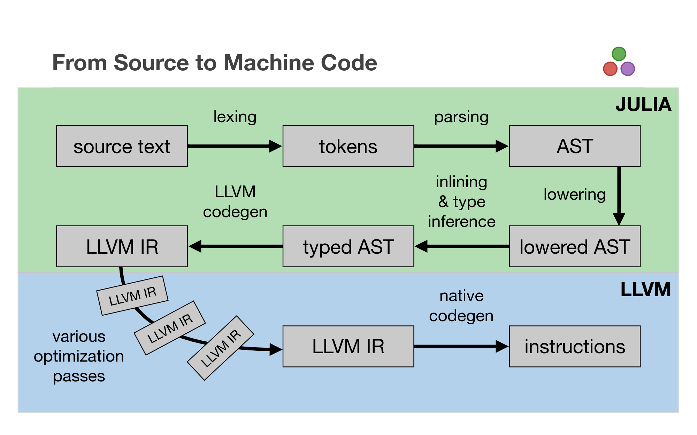
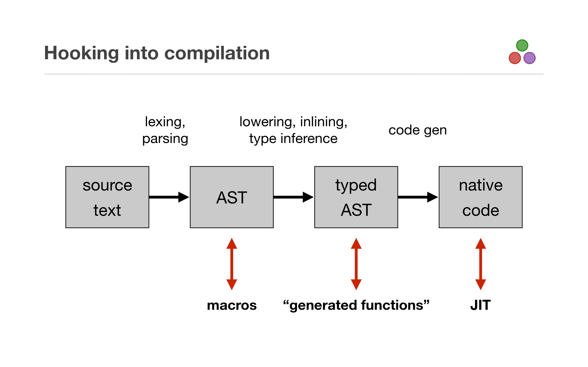

# How to talk to your compiler

Related lectures:
1. Lecture 6 -- 09/24 Macros
2. Lecture 11 -- 10/15 Performance
3. 2017: https://slides.com/valentinchuravy/julia-parallelism
4. CompilerIntrospection.ipynb

## Structure of the Julia compiler


Example function:

```julia
function f(x, y)
   return x^2 + 3*y
end
```

### Terminology
- IR: Intermediate Representation
- SSA: Single Static Assignment

## Stages



### Lowering & Macros

```julia
Meta.@lower return x^2 + 3*y
```

```julia
@code_lowered f(1, 2)
```

For more information see lecture 6

### Type-Inference and Optimisation

```julia
@code_typed optimize=false f(1, 2)
```

```julia
@code_typed optimize=true f(1, 2)
```

For more information see lecture 11

### Codegen

Codegen is the process of turning Julia's highlevel IR first into LLVM IR and then into
native assembly.

```julia
@code_llvm optimize=false f(1, 2)
```

```julia
@code_llvm optimize=true f(1, 2)
```

```julia
@code_native f(1, 2)
```

#### LLVM.jl

What does a compiler need to do?

Example:
```julia
g(x::Int64, y::Int64) = x + y
```

```julia
using LLVM
using LLVM.Interop

ctx = JuliaContext()
Tint64 = LLVM.Int64Type(ctx)

param_types = [Tint64, Tint64]
ret_type = Tint64
add, _ = create_function(ret_type, param_types)

# generate IR
Builder(ctx) do builder
   entry = BasicBlock(add, "entry", ctx)
   position!(builder, entry)

   tmp = add!(builder, parameters(add)[1], parameters(add)[2], "tmp")
   ret!(builder, tmp)
end

# make Julia compile and execute the function
push!(function_attributes(add), EnumAttribute("alwaysinline"))
@show add

ptr = LLVM.ref(add)
call_add(x, y) = Base.llvmcall(ptr, Int64, Tuple{Int64, Int64}, x, y)
@show call_add(1, 2)
@code_llvm call_add(1, 2)
```

## The work the Julia compiler needs to do

1. Lowering (we will skip this)
2. Type-Inference and high-level optimizations (very interesting, but we will also skip that!)
3. Codegen (let's zoom in on that)

### Obtaining the post-inference IR

```julia
args = (1, 2)
CI, rt = @code_typed f(args...)
```

### Simplistic codegen
```julia
using LLVM
using LLVM.Interop

ctx = JuliaContext()

types = Dict(
   Int64 => LLVM.Int64Type(ctx)
)

param_types = collect(types[typeof(a)] for a in args) # TODO get that info from CI
ret_type = types[rt]
func, _ = create_function(ret_type, param_types)

# generate IR
Builder(ctx) do builder
   entry = BasicBlock(func, "entry", ctx)
   position!(builder, entry)

   vars = Any[]
   for c in CI.code
      if c.head == :call
         args = c.args[2:end]
         llvm_args = Any[]
         for arg in args
            if arg isa Core.SlotNumber
               llvm_arg = parameters(func)[arg.id - 1] # hidden argument
            elseif arg isa Core.SSAValue
               llvm_arg = vars[arg.id]
            elseif arg isa Signed
               # Constants
               llvm_arg = ConstantInt(types[typeof(arg)], arg, true)
            else
               error("Can't handle $arg")
            end
            push!(llvm_args, llvm_arg)
         end

         f = c.args[1]
         if f.name == :mul_int
            v = mul!(builder, llvm_args...)
         elseif f.name == :add_int
            v = add!(builder, llvm_args...)
         else
            error("Can't handle $f")
         end
         push!(vars, v)
      elseif c.head == :return
         ret!(builder, vars[c.args[1].id])
      else
         error("Can't handle $c")
      end
   end
end

# make Julia compile and execute the function
push!(function_attributes(func), EnumAttribute("alwaysinline"))
@show func

ptr = LLVM.ref(func)
call_func(x, y) = Base.llvmcall(ptr, Int64, Tuple{Int64, Int64}, x, y)
@show call_func(1, 2)
@code_llvm call_func(1, 2)
```

#### Notes:
1. Incredibly primitive
2. Cheated a bit since we only have one datatype and we use LLVM typed IR to do the right thing
   ```julia
   f(Int32(1), 2)
   ```
3. Only support for "basic" functions
   ```julia
   f(x, y) = sin(x) + y
   ```
4. For a more comprehensive approach https://github.com/tshort/CodeGen.jl

#### References:
- https://github.com/staticfloat/llvmjltomfoolery
- https://github.com/maleadt/LLVM.jl
- https://llvm.org/docs/LangRef.html


### Other ways of talking to the compiler/system

#### LLVM

LLVM has several ways of getting more information!
As an example we can:

1. Print the IR before and after a pass
2. Obtain Remarks
3. Obtain debug remarks

What can we do?
```bash
JULIA_LLVM_ARGS="-help" julia
# or
JULIA_LLVM_ARGS="-help-hidden" julia
# or
JULIA_LLVM_ARGS="-help-list" julia
# or
JULIA_LLVM_ARGS="-help-list-hidden" julia
```

Note: One might have to use Julia 1.1-dev

##### Remarks

```bash
export JULIA_LLVM_ARGS="-pass-remarks-analysis=loop-vectorize"
# or
export JULIA_LLVM_ARGS="-pass-remarks-missed=loop-vectorize"
# or
export JULIA_LLVM_ARGS="-pass-remarks=loop-vectorize"
```

Examples:

```julia
function mysum(X)
   acc = zero(eltype(X))
   for i in eachindex(X)
      @inbounds acc += X[i]
   end
   return acc
end

mysum(zeros(1000))
```

```bash
➜  JULIA_LLVM_ARGS="-pass-remarks-analysis=loop-vectorize" ./julia test.jl
remark: float.jl:395:0: loop not vectorized: cannot prove it is safe to reorder floating-point operations
```

Add `@simd`

```bash
➜  JULIA_LLVM_ARGS="-pass-remarks=loop-vectorize" ./julia test.jl
remark: simdloop.jl:71:0: vectorized loop (vectorization width: 4, interleaved count: 4)
```
